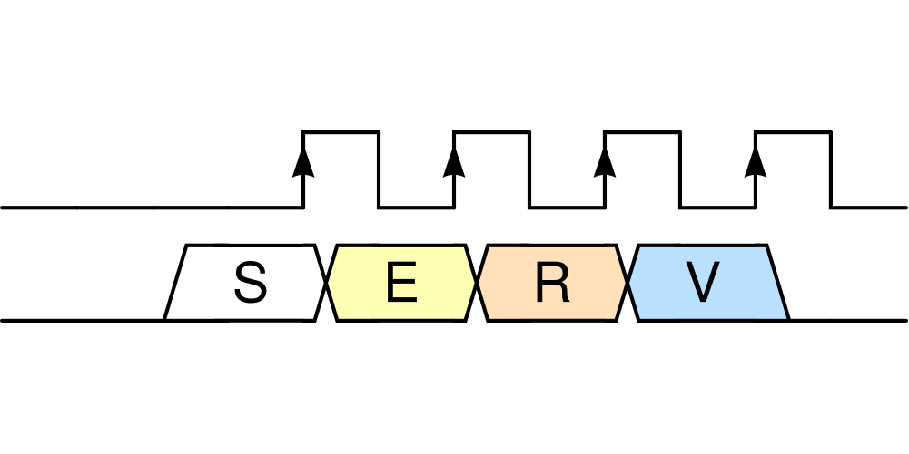
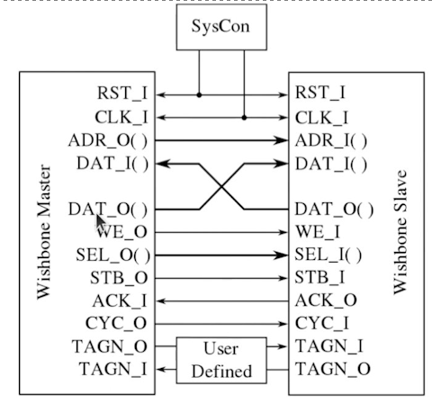
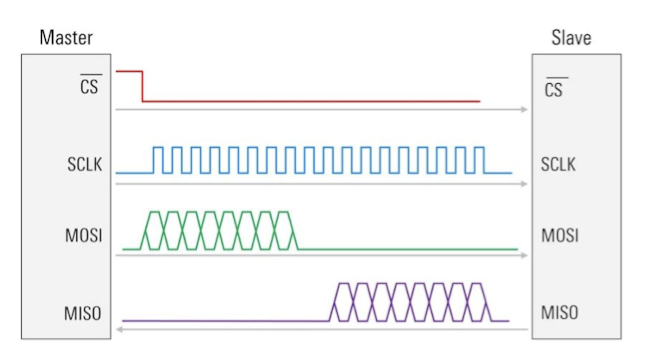
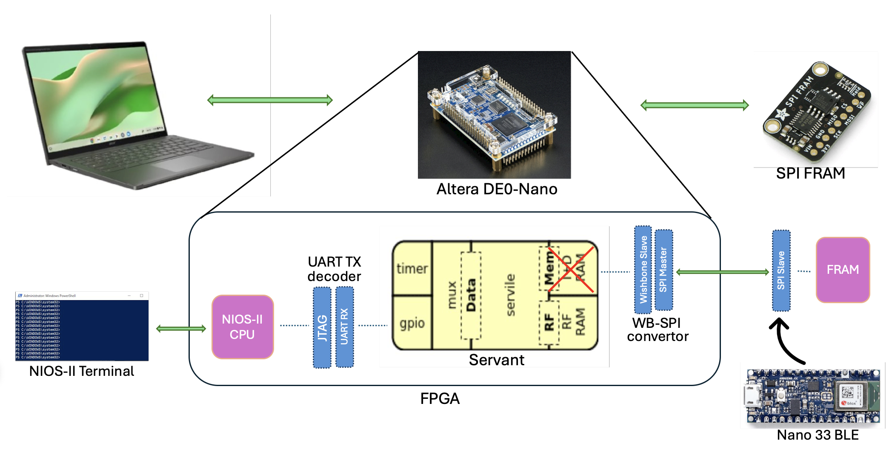
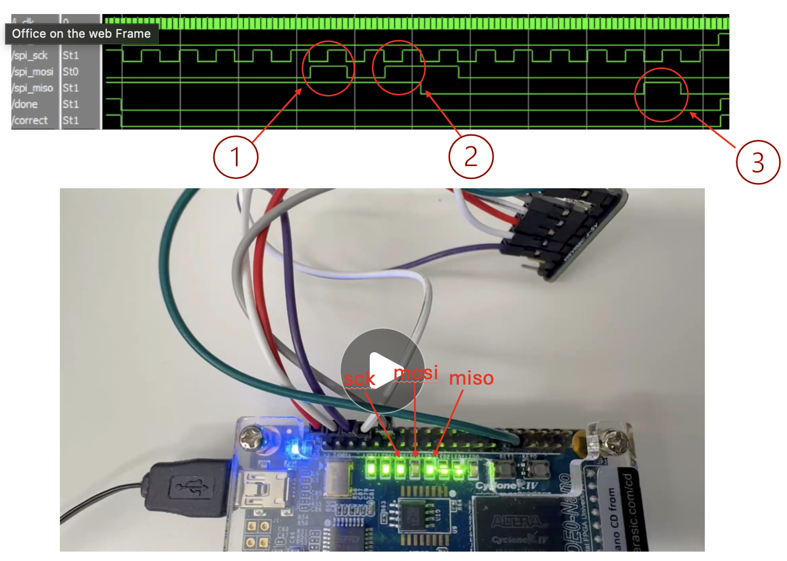
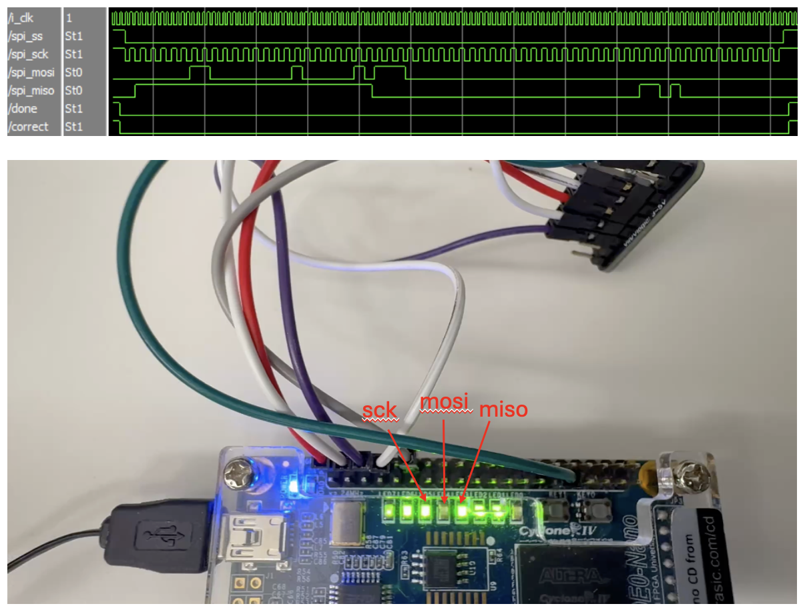

# Serial RISC-V (SERV) with SPI memory access

## 1. Project Outline

### Team Name:
FPGA Project Group 8

### Team Members:
- Bhasitha Dharmasena(bp2sq)
- Kavish Ranawella(bue6zr)

### Project Description:
Serial RISC-V (SERV) is bit-serial CPU that claims to be the world's smallest RISC-V CPU. In the current implementation, even though most of the core components are serialized, Register File and Memory accessing is still done parallely via a Wishbone interface. With this project, we aim to achieve pure serialization by implementing memory accessing through a Serial Peripheral Interface (SPI).

### Key Objectives:
- Integrate SPI-based memory access into the SERV processor to enable fully serial data handling.
- Minimize logic-to-memory interconnect complexity by reducing bus width and interface overhead.
- Explore architectural trade-offs in designing a purely serial RISC-V system.
- Deepen understanding of serial processor behavior and execution flow through hands-on implementation.

### Expected Outcomes:

- Simulation of the SERV processor with SPI memory access using Verilator.
- Hardware implementation of SERV integrated with SPI FRAM.
- Demonstration of bare-metal program execution on the implemented hardware.
- Demonstration of program execution on Zephyr OS on the implemented hardware.

### Tasks:

- Develop Verilog code for a Wishbone-to-SPI converter.
- Verify the Wishbone-to-SPI converter through simulation and hardware testing.
- Integrate the Wishbone-to-SPI converter with the SERV CPU.
- Perform full architecture verification using simulation tools (ModelSim, Verilator).
- Validate the complete design on hardware using the Altera DE0-Nano board and SPI FRAM.
- Run and demonstrate bare-metal programs on the final hardware implementation.
- Run and demonstrate programs in Zephyr OS on the final hardware implementation.
- Prepare comprehensive documentation covering the design, integration, testing, and results.

### File structure

- [serial_out](https://github.com/hplp/2025-fpga-design-projects-fpga_spi_serv/tree/main/serial_out): JTAG interface to collect the UART output of the SERV and print it on a terminal
- [testbench](https://github.com/hplp/2025-fpga-design-projects-fpga_spi_serv/tree/main/testbench): Verilog testbench for Wishbone-to-SPI convertor simulations
- [wb_spi_bridge_test](https://github.com/hplp/2025-fpga-design-projects-fpga_spi_serv/tree/main/wb_spi_bridge_test): Hardware test for the Wishbone-to-SPI convertor
- [with_spi_fram](https://github.com/hplp/2025-fpga-design-projects-fpga_spi_serv/tree/main/with_spi_fram): Verilog testbench for full architecture simulations
- [verilator_tb](https://github.com/hplp/2025-fpga-design-projects-fpga_spi_serv/tree/main/verilator_tb): Verilator testbench for full architecture simulations
- [fram_connect](https://github.com/hplp/2025-fpga-design-projects-fpga_spi_serv/tree/main/fram_connect): Hardware implementation of the full architecture

## 2. Project Overview

### What is SERV?

  

Serial RISC-V (SERV) is bit-serial CPU that claims to be the world's smallest RISC-V CPU. It is,
- Open source (under BSD license)
- Uses Wishbone interface for Data and Instruction Buses
- Compatible with Zephyr OS (light-weight, open-source OS by Linux Foundation)

For this project, we use **Servant** which is a reference platform which packages memory, GPIO and timers with SERV to make it a standalone computer. This also uses Wishbone for the memory interfaces.

### Wishbone vs SPI (Serial Peripheral Interface)

Wishbone:
- A parallel synchronous protocol
- Relatively high speed - **Can access 1 word using 1 clock cycle**
- Requires high wire count **(100+ in total)**

  

> *Figure: Wishbone connection*

SPI
- A synchronized serial communication protocol
- Can integrate with **4 wires total**
- A Master-Slave Architecture
- Relatively slow - **require 64 clock cycles to access 1 word** 

  

> *Figure: SPI connection*

  

> *Figure: SPI Read (1 word)*

### Full architecture

  

Hardware components:
- Altera DE0-Nano board
- Adafruit SPI Non-Volatile FRAM Breakout (256 KB)

For this project, we removed the I+D RAM in Servant and added a Wishbone-to-SPI convertor to use the SPI FRAM. On the other side, we implemented a UART TX decoder to capture data sent through the UART TX pin and print it on the NIOS-II terminal. We used a Nano 33 BLE board to write programs to the SPI FRAM.

## 3. Results:

### SPI Demonstrations

#### Read Status Register

In this video we are demonstrating an SPI communication where the master reads the value in stored in the status register of the SPI FRAM. This takes 16 clock cycles to complete; 8 to send the relavant opcode to the SPI FRAM, and remaining 8 for SPI FRAM to send back the values stored in the status register.

  

During this demonstration we have slowed down the SPI transfer to a speed at which each bit transfer can be tracked. Upon a button press, the **spi_cs** goes down and the **spi_sck** start oscillating to give the reference clock. The data relevant for each bit is given at the negative edge of the clock, so that it can be sampled at the positive edge of the clock. The three instances where the **spi_mosi** and **spi_miso** is high is highlighted in the given waveform. During the video, you can count each bit according the LED blinks of the **spi_sck** and see whether the **spi_mosi** and **spi_miso** LEDs lights up at the relevant clock cycles. At the end of the communication, **done** and **correct** LEDs lights up indicating that it had finished reading and that it got the expected value.

  

#### Read 1 word

In this video we are demonstrating an SPI communication where the master reads one full word (32 bits) from the SPI RAM. This takes 64 cycles in total; first 8 to send the relevant opcode to the SPI FRAM, next 24 to send the 18-bit address to the SPI FRAM, and the final 32 for the SPI FRAM to send back the data of the relevant word.

  

During this demonstration we have made the SPI transfer a bit more faster to see the entire 64 cycles within a shorter period. But this too is very slow when compared to the transfer speed used in our actual implementation (can transfer in speeds in the MHz scale).

  

### SERV demostrations

#### Simple LED blink code

Here we are 

