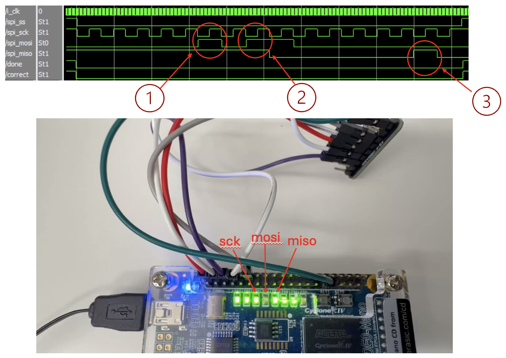
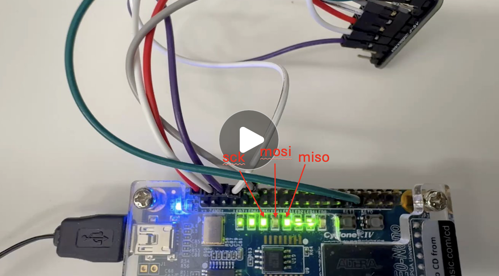
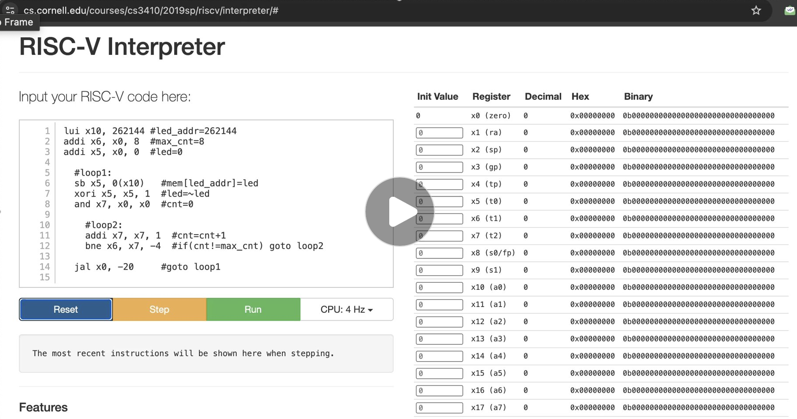
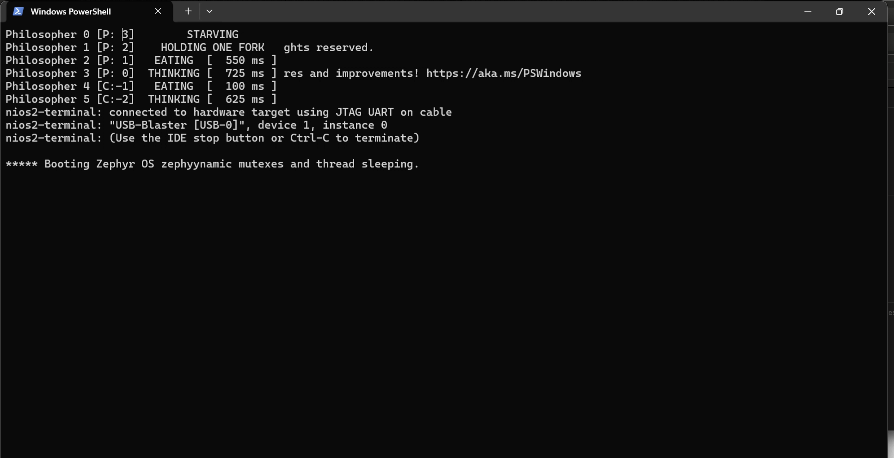
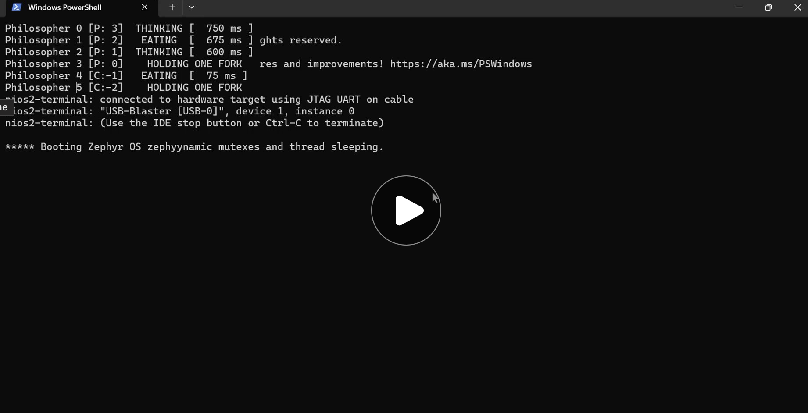

# Serial RISC-V (SERV) with SPI memory access

## 1. Project Outline

### Team Name:
FPGA Project Group 8

### Final Presentation
[Slides](https://myuva-my.sharepoint.com/:p:/g/personal/bp2sq_virginia_edu/EbR7KFxK4rZKp4n9x-FtiA0BusmC7vetWjMRAcpkG8rAVw?e=tEiBrJ)

### Team Members:
- Bhasitha Dharmasena(bp2sq)
- Kavish Ranawella(bue6zr)

### Project Description:
Serial RISC-V (SERV) is bit-serial CPU that claims to be the world's smallest RISC-V CPU. In the current implementation, even though most of the core components are serialized, Register File and Memory accessing is still done parallely via a Wishbone interface. With this project, we aim to achieve pure serialization by implementing memory accessing through a Serial Peripheral Interface (SPI).

### Key Objectives:
- Integrate SPI-based memory access into the SERV processor to enable fully serial data handling.
- Minimize logic-to-memory interconnect complexity by reducing bus width and interface overhead.
- Explore architectural trade-offs in designing a purely serial RISC-V system.
- Deepen understanding of serial processor behavior and execution flow through hands-on implementation.

### Expected Outcomes:

- Simulation of the SERV processor with SPI memory access using Verilator.
- Hardware implementation of SERV integrated with SPI FRAM.
- Demonstration of bare-metal program execution on the implemented hardware.
- Demonstration of program execution on Zephyr OS on the implemented hardware.

### Tasks:

- Develop Verilog code for a Wishbone-to-SPI converter.
- Verify the Wishbone-to-SPI converter through simulation and hardware testing.
- Integrate the Wishbone-to-SPI converter with the SERV CPU.
- Perform full architecture verification using simulation tools (ModelSim, Verilator).
- Validate the complete design on hardware using the Altera DE0-Nano board and SPI FRAM.
- Run and demonstrate bare-metal programs on the final hardware implementation.
- Run and demonstrate programs in Zephyr OS on the final hardware implementation.
- Prepare comprehensive documentation covering the design, integration, testing, and results.

### File structure

- [serial_out](https://github.com/hplp/2025-fpga-design-projects-fpga_spi_serv/tree/main/serial_out): JTAG interface to collect the UART output of the SERV and print it on a terminal
- [testbench](https://github.com/hplp/2025-fpga-design-projects-fpga_spi_serv/tree/main/testbench): Verilog testbench for Wishbone-to-SPI convertor simulations
- [wb_spi_bridge_test](https://github.com/hplp/2025-fpga-design-projects-fpga_spi_serv/tree/main/wb_spi_bridge_test): Hardware test for the Wishbone-to-SPI convertor
- [with_spi_fram](https://github.com/hplp/2025-fpga-design-projects-fpga_spi_serv/tree/main/with_spi_fram): Verilog testbench for full architecture simulations
- [verilator_tb](https://github.com/hplp/2025-fpga-design-projects-fpga_spi_serv/tree/main/verilator_tb): Verilator testbench for full architecture simulations
- [fram_connect](https://github.com/hplp/2025-fpga-design-projects-fpga_spi_serv/tree/main/fram_connect): Hardware implementation of the full architecture

## 2. Project Overview

### What is SERV?

  

Serial RISC-V (SERV) is bit-serial CPU that claims to be the world's smallest RISC-V CPU. It is,
- Open source (under BSD license)
- Uses Wishbone interface for Data and Instruction Buses
- Compatible with Zephyr OS (light-weight, open-source OS by Linux Foundation)

For this project, we use **Servant** which is a reference platform which packages memory, GPIO and timers with SERV to make it a standalone computer. This also uses Wishbone for the memory interfaces.

### Wishbone vs SPI (Serial Peripheral Interface)

Wishbone:
- A parallel synchronous protocol
- Relatively high speed - **Can access 1 word using 1 clock cycle**
- Requires high wire count **(100+ in total)**

  

> *Figure: Wishbone connection*

SPI
- A synchronized serial communication protocol
- Can integrate with **4 wires total**
- A Master-Slave Architecture
- Relatively slow - **require 64 clock cycles to access 1 word** 

  

> *Figure: SPI connection*

  

> *Figure: SPI Read (1 word)*

### Why integrate SPI with SERV?

- **Decouples memory from CPU core**: Enables flexible memory placement and simplifies physical design for fabrication

- **Minimal pin count**: Communicates with external RAM using only 4 wires (MISO, MOSI, SCK, CS), reducing I/O complexity

- **Aligns with SERV’s bit-serial philosophy**: Maintains SERV’s ultra-minimal, bit-serial architecture by extending serial design principles to memory access

- **Shrinks logic footprint**: Removes internal RAM, reducing FPGA resource usage and improving area efficiency for ASIC targets

### Full architecture

  

Hardware components:
- Altera DE0-Nano board
- Adafruit SPI Non-Volatile FRAM Breakout (256 KB)
- Arduino Nano 33 BLE Rev2

For this project, we removed the I+D RAM in Servant and added a Wishbone-to-SPI convertor to use the SPI FRAM. On the other side, we implemented a UART TX decoder to capture data sent through the UART TX pin and print it on the NIOS-II terminal. We used a Nano 33 BLE board to write programs to the SPI FRAM.

## 3. Results:

### SPI Demonstrations

#### Read Status Register

In this video we are demonstrating an SPI communication where the master reads the value in stored in the status register of the SPI FRAM. This takes 16 clock cycles to complete; 8 to send the relavant opcode to the SPI FRAM, and remaining 8 for SPI FRAM to send back the values stored in the status register.

  

During this demonstration we have slowed down the SPI transfer to a speed at which each bit transfer can be tracked. Upon a button press, the **spi_cs** goes down and the **spi_sck** start oscillating to give the reference clock. The data relevant for each bit is given at the negative edge of the clock, so that it can be sampled at the positive edge of the clock. The three instances where the **spi_mosi** and **spi_miso** is high is highlighted in the given waveform. During the video, you can count each bit according the LED blinks of the **spi_sck** and see whether the **spi_mosi** and **spi_miso** LEDs lights up at the relevant clock cycles. At the end of the communication, **done** and **correct** LEDs lights up indicating that it had finished reading and that it got the expected value.

  

#### Read 1 word

In this video we are demonstrating an SPI communication where the master reads one full word (32 bits) from the SPI RAM. This takes 64 cycles in total; first 8 to send the relevant opcode to the SPI FRAM, next 24 to send the 18-bit address to the SPI FRAM, and the final 32 for the SPI FRAM to send back the data of the relevant word.

  

During this demonstration we have made the SPI transfer a bit more faster to see the entire 64 cycles within a shorter period. But this too is very slow when compared to the transfer speed used in our actual implementation (can transfer in speeds in the MHz scale).

  

### SERV demostrations

#### Simple LED blink code

Here we are demonstrating a simple RISC-V assembly code that is used to blink an LED. In line 1, we are loading the address of the GPIO pin relavant to the LED into the register **x10** of the register file. The addresses of GPIO pins are outside the addresses available within the SPI FRAM (18 bit address = 256KB of memory). In lines 2 and 3 initial values are set for **x6** (maximum count) and **x5** (the next value for the LED) registers. Here **x0** is a special regsiter where the value is always 0. Next, we have two nested loops as **loop1** and **loop2**. **loop2** is used to increment the count at **x7** and when it reaches the maximum count, it exists to **loop1** where the LED is set using a SW (Store Word) instruction, the next value of the LED is set at **x5**, and the count in **x7** is reset to 0, before entering the **loop2** again.

  

Since RISC-V is an open-source ISA, you can find a lot of tools like this to visualize the instruction execution. These are some tools we used for this project,
- [RISC-V Instruction Encode/Decoder](https://luplab.gitlab.io/rvcodecjs/#q=sh+x7,+18(x11)&abi=false&isa=AUTO): Used to convert instructions between Assembly and Machine code.
- [RISC-V Interpreter](https://www.cs.cornell.edu/courses/cs3410/2019sp/riscv/interpreter/#): This is the tool used in our demonstrations.

#### The Dining Philosophers Problem
The Dining Philosophers Problem is a classic example in computer science that illustrates issues related to synchronization, concurrency, and resource sharing. The main objective of this is to avoid deadlock.

  

- There are five philosophers sitting around a circular table.
- Each philosopher alternates between thinking and eating.
- In front of each philosopher is a plate of spaghetti, and between each pair of philosophers is one fork (so 5 philosophers, 5 forks total).
- To eat, a philosopher needs both the left and right forks.
- A philosopher must pick up the left fork and the right fork, eat, and then put them down.

In this video, we are demonstrating a program to tackling this Dining Philosophers Problem running on Zephyr OS booted onto SERV. Here the instructions have already been uploaded to the SPI FRAM using a Nano 33 BLE and we start by uploading the bitstream to the FPGA and opening the NIOS-II terminal to watch what SERV prints on it. At the start, it prints that the Zephyr OS is successfully booted and then gives a description of the program is is going to run for the Dining Philosophers Problem. Howeveer, we miss most of the description since NIOS-II has buffer for the JTAG which gets filled up quickly if there is not terminal for it to dump every data it gets. So, we miss some data that is sent to it during the time it takes for us to open the NIOS-II terminal after uploading the bitstream to the FPGA. Once the program starts, it prints the status of each Philosopher one-by-one. The statuses include **Eating**, **Thinking**, **Starving**, **Holding one fork** and **Dropped one fork**. When the status of each philosopher change, it is updated on the terminal by SERV.

  

As mentioned above, this program is running on Zephyr OS booted onto SERV. However, currently we are using the Nano 33 BLE to upload the instructions into the SPI FRAM everytime we want to run it. SERV doesn't have a bootloader to boot a fresh copy of the instructions every time is restarts. In this video, we are uploading the bitstream again while the program is running on SERV. This will force the SERV to restart but the memory will stay at the same state at which it was at the last instruction it was executing. Once SERV is restarted, the program will run from the beginning and will work fine until it prints the status of all the Philosophers once. Then the program gets stuck and then it crashes. However, since Zephyr OS is still running, it will detect that the program crashed and will start printing error messages indicating that. This proves that Zephyr OS is indeed booted up on SERV and is not running a baremetal application for the Dining Philosophers Problem.

  

### Resource Utilization

| Architecture | Combinational ALUTs | Dedicated Logic Registers | Memory bits |
|--------------|---------------------|---------------------------|-------------|
| Without SPI  | 458                 | 252                       | 263296      |
| With SPI     | 574.                | 333                       | 1152        |

With our design, we have removed Instruction and Data Memories from the FPGA, hence we have saved up a lot in Memory bits. However, since we are using the a Wishbone-to-SPI converter for this project, the number of logic elements have increased. Instead of that, if we replaced the Wishbone with SPI we could reduce the number of logic elements as well. The remaining memory bits in our design are the memory bits used for the Register File, which is still in the FPGA.

## 4. Conclusion

In the Project Overview, we have discussed why we need to integrate SPI into SERV. This project has achieved them as follows,

- **Decouples memory from CPU core**: Enables flexible memory placement and simplifies physical design for fabrication-  ***FULLY ACHIEVED***

- **Minimal pin count**: Communicates with external RAM using only 4 wires (MISO, MOSI, SCK, CS), reducing I/O complexity -  ***FULLY ACHIEVED***

- **Aligns with SERV’s bit-serial philosophy**: Maintains SERV’s ultra-minimal, bit-serial architecture by extending serial design principles to memory access -  ***PARTIALLY ACHIEVED***

- **Shrinks logic footprint**: Removes internal RAM, reducing FPGA resource usage and improving area efficiency for ASIC targets -  ***PARTIALLY ACHIEVED***

The first two were fully achieved, since now the memory is placed externally in an FRAM and accessed through SPI which only uses 4 wires. However, the last two were only partially achieved since for this project we are using a Wishbone-to-SPI convertor. The memory accessing is done serially but the Wishbone part still exists in the middle. We have reduced the footprint by moving the memory to an external device, but still we have added logic relevant to the convertor. By replacing Wishbone with SPI in future work, we can fully achieve these two as well. With this project, we have proved the feasibility of doing so.

## 5. Future Work

- **Eliminate Wishbone**: Replace the Wishbone bus with a fully bit-serial interconnect to further reduce logic complexity and align with SERV’s serial architecture.

- **Add bootloader support**: Enable loading programs such as Zephyr RTOS from SPI RAM or other sources at startup.

- **Integrate basic peripherals**:
  * **GPIO**: Provide general-purpose I/O for basic hardware interfacing.
  * **UART (RX)**: Allow serial communication for debugging or basic shell interaction.

- **Implement I2C-based memory access**: Use I2C as an alternative to SPI for connecting external RAM — reducing wire count even further in ultra-minimal systems.

## 6. References

- [Original SERV Github](https://github.com/olofk/serv)
- [Original SERV Documentation](https://serv.readthedocs.io/en/latest/reservoir.html)
